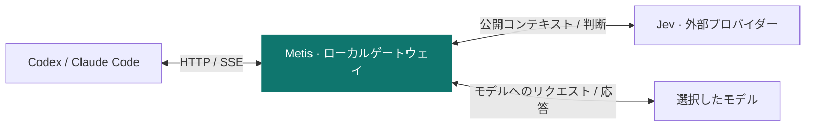

<p align="center">
  
</p>

<h1 align="center">Metis</h1>

<p align="center">Jev が Codex と Claude Code のツールと推論の強度を判断します。</p>

<p align="center">
  <a href="https://github.com/gaeng2y/llm-metis/actions/workflows/ci.yml"></a>
  
  
</p>

<p align="center">
  <a href="README.md">English</a> · <a href="README.ko.md">한국어</a> · <a href="README.ja.md">日本語</a> · <a href="README.zh-CN.md">简体中文</a>
</p>

<p align="center">
  <a href="#quick-start">クイックスタート</a> · <a href="#how-it-works">仕組み</a> · <a href="#providers">プロバイダー</a> · <a href="#commands">コマンド</a> · <a href="#reference">詳細設定</a> · <a href="#platforms">プラットフォーム</a>
</p>

**llm-metis** は、ローカルゲートウェイを経由してターミナルで Codex または Claude Code を起動します。作業するプロジェクトのディレクトリで `metis-codex` または `metis-claude` を実行してください。Jev はゲートウェイの判断エンジンで、クライアントで選んだモデルを維持しながら、1回の評価でツールと推論の強度（reasoning effort）を選択します。

<a id="quick-start"></a>

## クイックスタート

**事前準備:** Node.js 22.15 以降と、使用するプラットフォームにインストールして認証済みの Codex CLI または Claude Code が必要です。

### 1. インストールと設定

macOS、Linux、Windows PowerShell でリポジトリからインストールします。

```sh
git clone https://github.com/gaeng2y/llm-metis.git
cd llm-metis
npm install
npm link
metis-codex configure
```

`npm install` が CLI を自動ビルドし、`npm link` が `metis-codex` と `metis-claude` を PATH に登録します。npm レジストリへの公開を必要としないソースからのインストールです。設定コマンドで OpenRouter、Vercel、TypeSafe のいずれかを選び、API キーを入力します。キーは画面に表示されず、`.env` の手動編集は不要です。

### 2. コーディングクライアントを起動

その後、作業するプロジェクトのディレクトリから、使いたいコマンドを実行します。

```sh
metis-codex
# または Claude Code を起動:
metis-claude
```

各コマンドはゲートウェイを自動起動し、同じターミナルと現在のディレクトリで選択したクライアントの対話画面を開きます。別途 `--start` を実行する必要はありません。両コマンドは、保存した Jev 設定、ルーティング制御、ダッシュボードをプロジェクト間で共有します。認証情報がない場合や Jev が失敗した場合は、元のモデルリクエストを転送します。キーが未設定の場合、ダッシュボードには `Credentials: missing` と `jev_credentials_missing` が表示されます。

<a id="how-it-works"></a>

## 仕組み



モデルの認証とツールの実行は Codex と Claude Code が担当します。Metis は、ツールと推論の強度それぞれの信頼度基準を満たした判断のみを適用し、不確かな部分は元のリクエストを維持します。

Jev には、直近の公開された会話コンテキスト、公開要約、長さを制限したツール結果の抜粋、利用可能なツール定義を渡します。画像と暗号化された reasoning 項目は除外します。**ゲートウェイはローカルで動作しますが、判断のための推論は選択した外部プロバイダーで行われます。**

<a id="providers"></a>

## Jev プロバイダーを選ぶ

設定コマンドはどのディレクトリからでも実行できます。`metis-codex configure` と `metis-claude configure` は同じ設定を更新します。選択した Jev プロバイダーの認証情報は Codex または Claude Code のログインとは別です。

| プロバイダー | 選択値 | 任意の認証用環境変数 | デフォルトモデル |
|---|---|---|---|
| [OpenRouter](https://openrouter.ai/blog/insights/what-is-jev/) (デフォルト) | `openrouter` | `OPENROUTER_API_KEY` | `typesafe/jev-1.13` |
| [Vercel AI Gateway](https://vercel.com/docs/ai-gateway/modalities/evaluation) | `vercel` | `AI_GATEWAY_API_KEY` | `typesafe-ai/jev` |
| [TypeSafe](https://docs.typesafe.ai/api) | `typesafe` | `TYPESAFE_API_KEY` | `jev-latest` |

[Astra-Ares の設定方式](https://github.com/miuuyy/Astra-Ares/blob/main/docs/configuration.md)と同様に、プロバイダーは明示的に選択します。保存済みの選択も環境変数による指定もなければ、`openrouter` がデフォルトです。他のキーが設定されていても選択は変わらず、エラーが起きても別のプロバイダーへ切り替えません。認証情報がない場合や評価に失敗した場合は、元のモデルリクエストを維持します。

設定を保存しても、稼働中のゲートウェイは再起動しません。実行中のタスクが終了してから再起動し、状態を確認してください。

```sh
metis-codex --stop
metis-codex --start
metis-codex --status
```

`jevConfigured: true` はキーが読み込まれたことを示し、キーの有効性や実際の Jev 判断の成功を確認するものではありません。タスク実行後にダッシュボードで評価の成否と適用された effort を確認してください。

<a id="commands"></a>

## よく使うコマンド

| 操作 | コマンド |
|---|---|
| ゲートウェイを起動 | `metis-codex --start` |
| 状態を確認 | `metis-codex --status` |
| ダッシュボードを開く | `metis-codex --dashboard` |
| 両方の判断を無効化 | `metis-codex --routing off` |
| ツールの判断を有効化 | `metis-codex --tool-routing on` |
| 推論の強度の判断を無効化 | `metis-codex --effort-routing off` |
| ゲートウェイを停止 | `metis-codex --stop` |

```sh
# クライアントのオプションとコマンドは -- の後に渡します。
metis-codex -- --model gpt-6-astra
metis-codex -- exec --model gpt-6-astra 'ここにタスクを記述してください'
metis-claude -- --model sonnet
metis-claude -- -p 'ここにタスクを記述してください'
```

上記の制御コマンドは `metis-claude` でも利用できます。ルーティングコマンドとダッシュボードの変更は、稼働中のゲートウェイが処理する次のリクエストから適用されます。再起動すると保存した設定と環境変数を再読み込みします。環境変数、認証情報、upstream URL を変更した後は、`--stop`、`--start` の順に実行してください。同じ状態ディレクトリを使うターミナルは1つのゲートウェイを共有します。独立した実験には、`METIS_STATE_DIR` と `METIS_PORT` の両方に異なる値を指定します。

<a id="reference"></a>

## 詳細設定と動作規則

<details>
<summary>クライアントの認証と upstream</summary>

CLI は `-c model_provider=…` とプロバイダー設定を、自身が起動する Codex プロセスにのみ渡します。`~/.codex/config.toml` やログインファイルは変更しません。モデルの認証と認証情報の更新は Codex が担当し、ゲートウェイは `Authorization` と `ChatGPT-Account-Id` を upstream に転送します。Jev の認証情報は、別途送信する評価リクエストにのみ使用します。

読み取り可能な Codex の `auth.json` が ChatGPT ログインを示す場合、デフォルトの upstream は `https://chatgpt.com/backend-api/codex` です。それ以外は `https://api.openai.com/v1` になります。**キーチェーンのみで認証情報を管理するログインや、カスタムプロバイダーでは `UPSTREAM_BASE_URL` を明示してください。** 稼働中のゲートウェイはログイン方式の変更に自動追従しません。

ランチャーは HTTP/SSE を使うため、その実行に限って `supports_websockets=false` を設定します。未対応の WebSocket 接続は拒否します。この CLI は、Codex デスクトップアプリの既存タスクを自動的に接続するものではありません。

Claude Code には、認証情報を含むループバック URL を指定する非公開の一時 `--settings` ファイルを渡します。ローカルトークンはカスタムヘッダーではなく URL に含め、upstream への転送前に除去します。ユーザー設定、ログインファイル、既存のカスタム認証ヘッダーは維持します。ゲートウェイは `x-api-key`、`Authorization`、Anthropic の version/beta ヘッダーを転送し、ダミーの API キーには置き換えません。モデルの認証は Claude Code が担当します。upstream はゲートウェイ起動時に継承した `ANTHROPIC_BASE_URL`、未設定なら `https://api.anthropic.com` です。`METIS_ANTHROPIC_BASE_URL` で上書きできます。Bedrock、Vertex、Foundry モードは未対応で、設定を検出した場合は起動を拒否します。管理設定によってルーティングが上書きされる場合があり、Metis は組織のポリシーを無視しません。実際のサブスクリプション、モデル、企業環境での互換性は別途検証が必要です。

</details>

<details>
<summary>保存済み設定と環境変数</summary>

```sh
metis-codex configure
# プロバイダーを直接選び、非表示のプロンプトでキーを入力します。
metis-codex configure --provider openrouter
# configure の別名です。
metis-codex configuration
# キーを表示せず、設定ファイルの場所を確認します。
metis-codex config-path
```

キー入力時に Enter を押すと、そのプロバイダーに保存済みのキーを維持します。OpenRouter、Vercel、TypeSafe のキーは個別に保存されるため、切り替えても他のキーは削除されません。パスワードマネージャーや自動化では、キーをコマンド引数に入れず、`metis-codex configure --provider openrouter --key-stdin` にパイプで渡せます。

設定は `~/.config/llm-metis/config.json`（Windows は `%USERPROFILE%\.config\llm-metis\config.json`）に保存します。`XDG_CONFIG_HOME` で設定の基準ディレクトリを、`METIS_CONFIG` でファイルの場所を変更できます。Unix では 0600、Windows では現在のユーザーのみを許可する DACL を適用します。API キーはリポジトリではなく、この保護されたローカルファイルに保存します。

環境変数や現在のディレクトリの `.env` に空欄でないプロバイダーまたはキーがあれば、保存した設定より優先します。空のキー値は保存済みの認証情報を無効にしません。`configure` は上書き設定がある場合に通知します。既存の `.env` を使っている場合、保存した設定を使うには競合する `METIS_PROVIDER`（旧名 `JEV_PROVIDER`）とキーの項目を削除してください。高度な設定用の環境変数は `.env.example` に記載していますが、その使用は任意です。

従来の `JEV_*` 環境変数は、対応する `METIS_*` が未設定の場合に読み込みます。`METIS_*` は空欄でも優先され、プロバイダーが空欄なら保存済みの選択またはデフォルトを使用します。新しく設定する場合は `METIS_*` を使用してください。

| 環境変数 | デフォルト / 説明 |
|---|---|
| `METIS_PROVIDER` | 空欄でない値は保存したプロバイダーより優先。それ以外は保存した選択、なければ `openrouter`。`openrouter`、`vercel`、`typesafe` から選択し、自動切り替えなし |
| `METIS_CONFIG` | 保存する設定ファイルのパス。相対パスは現在のディレクトリから解決 |
| `XDG_CONFIG_HOME` | `llm-metis/config.json` の基準ディレクトリ。デフォルトは `~/.config` |
| `METIS_MODEL`, `METIS_URL` | 選択したプロバイダーの評価 API 形式を維持してモデルとエンドポイントを上書き。任意の chat-completions エンドポイントは未対応 |
| `METIS_TOOL_MIN_CONFIDENCE` | `0.85` |
| `METIS_EFFORT_MIN_CONFIDENCE` | `0.85` |
| `METIS_TIMEOUT_MS` | `2000`。判断全体の待機期限。再試行なし |
| `METIS_ROUTING` | `on`。起動時に両方の判断を有効化または無効化 |
| `METIS_TOOL_ROUTING`, `METIS_EFFORT_ROUTING` | どちらも `on` |
| `METIS_DIRECT_CALLS` | `off`。制限付きの関数呼び出し合成を明示的に有効化 |
| `METIS_PORT` | `8791`。常に `127.0.0.1` のみにバインド |
| `UPSTREAM_BASE_URL` | 上記のログイン方式に応じて選択。URL 内の認証情報とクエリパラメーターは禁止 |
| `METIS_STATE_DIR` | `~/.local/state/llm-metis`（Windows は `%USERPROFILE%\.local\state\llm-metis`）。ローカルトークンファイルは Unix では 0600、Windows では現在のユーザーのみを許可する DACL を適用 |
| `METIS_CODEX_BIN` | `codex`。ネイティブ実行ファイル、または `.js` / `.mjs` / `.cjs` のエントリーポイントで上書き可能 |
| `METIS_CLAUDE_BIN` | `claude`。上記と同じ実行ファイル/エントリーポイントの指定に対応 |
| `METIS_ANTHROPIC_BASE_URL` | Claude の upstream。継承した `ANTHROPIC_BASE_URL`、未設定なら `https://api.anthropic.com` |

</details>

<details>
<summary>ソース開発、更新、デスクトップ連携</summary>

ソース開発で `npm link` を使わない場合は、このチェックアウト内で `node bin/metis-codex.mjs …` または `node bin/metis-claude.mjs …` を実行できます（`npm run codex` / `npm run claude`）。`llm-metis` は `metis-codex` の別名です。

既存のチェックアウトを更新した場合は、`npm install` と `npm link` を再実行して新しいコマンドを登録してください。実行中のタスクが終了した後、`metis-codex --stop`、`metis-codex --start` の順に実行します。以前のデフォルト状態ディレクトリにあるゲートウェイも検出して安全に停止できますが、自動では再起動しません。

Windows ではネイティブの `codex.exe` / `claude.exe` と標準 npm インストールの `codex.cmd` / `claude.cmd` に対応します。npm ランチャーはシェルを使わず、それぞれの公式 JavaScript エントリーポイントを実行します。`METIS_CODEX_BIN` と `METIS_CLAUDE_BIN` にはネイティブ実行ファイル、または `.js`、`.mjs`、`.cjs` のエントリーポイントを指定できます。独自の `.cmd` / `.bat` ランチャーには対応していません。

ダッシュボードは macOS の `open`、Linux の `xdg-open`、Windows の `rundll32` で開きます。Linux で開くには、デスクトップセッションと `xdg-open` が必要です。

</details>

<details>
<summary>判断ポリシー</summary>

以下は Codex Responses のルーティング規則です。Claude Messages も同じ信頼度判定、タイムアウト、元リクエストへのフォールバックを使います。Claude の effort はリクエストに `output_config.effort` がある場合に限り変更し、ツールの強制指定はモデルと thinking の制約に従います。Claude の応答は `direct` 経路で合成しません。トークン数の計算リクエストは変更せず転送します。

- ツールと effort のしきい値は独立しています。一方だけが十分な信頼度を持つ場合、その部分だけを変更します。どちらも不確実なら、元のバイト列をそのまま転送します。
- 呼び出し元が指定した `tool_choice=none`、`required`、特定ツール、allowed-tools の設定は維持します。effort は独立して評価できます。
- `forced` は対応する function/custom ツールの `tool_choice` を設定します。`none` は次の応答でのツール使用を無効にし、`passthrough` はツール設定を変更しません。
- `direct` には明示的な有効化と `store:false` が必要です。有限の選択肢からなる関数引数を検証し、Responses の関数呼び出しを合成します。**ゲートウェイ自体はツールを実行しません。** 自由記述の引数や未対応の JSON Schema 制約がある場合、引数の生成はメインモデルに任せます。JSON と SSE の両方に対応し、この経路では effort を適用しません。
- ツールの抽出は `additional_tools` と namespace に対応しています。hosted ツールと、デフォルトの `functions` namespace 以外のツールは候補として扱いますが、強制指定はしません。ツールが120個を超えると、2回目の Jev 呼び出しを追加せずにツールルーティングをスキップします。
- `previous_response_id`、`conversation`、opaque item reference によってサーバー側の履歴が見えないリクエストは、評価せず転送します。`configuration_update` がある場合は effort の書き換えをスキップします。`/responses/compact` も変更せず転送します。
- Jev のエラー、タイムアウト、不正な回答は元のリクエストへのフォールバックになります。upstream が書き換え後のリクエストを HTTP 400/422 で拒否した場合、元のリクエストで1回だけ再試行します。成功した応答や開始済みのストリームは再試行しません。

</details>

<details>
<summary>ダッシュボードのデータと比較</summary>

プロンプト、引数、認証ヘッダー、API キーはログに記録しません。ダッシュボードは、リクエスト時点の実験モード、提案・適用されたツールと effort、信頼度、Jev のプロバイダー・モデル・遅延・使用量、upstream のトークン・キャッシュ・推論使用量、モデルと全体の遅延、結果の状態をメモリ内に保持します。生のプロンプトやプロバイダーのエラー本文は保持しません。

- 保持するのは最新2,000件のリクエストと200件のラッパーセッションです。再起動すると消去されます。
- モデル遅延は upstream リクエストの送信からストリーム終了までです。元のリクエストを再試行した場合は、両方の試行時間を含みます。
- 使用量が不明な場合はゼロではなく `—` と表示します。`*` は、一部のリクエストのみが使用量を報告したことを示します。
- direct 呼び出しの upstream トークン使用量はゼロです。Jev の使用量は別途記録します。プロバイダーの料金を検証していないため、ドル換算のコストは計算しません。
- タスク所要時間は、`metis-codex` または `metis-claude` が起動したクライアントプロセスの全実行時間です。対話セッションではユーザーの待ち時間も含みます。比較には `metis-codex -- exec …` または `metis-claude -- -p …` で1回につき1タスクを実行してください。セッション中にモードを変えると、タスク単位の比較の信頼性が下がります。
- ダッシュボードのトークンは URL fragment で渡した後、アドレスから削除します。制御 API とモデルプロキシの両方に、別途ローカルトークンが必要です。外部の Origin/Host ヘッダーは拒否します。

4つのモードを比較する際は、モデル、初期 effort、リポジトリの開始状態、タスクを揃え、各結果の品質も確認してください。

| モード | Tool | Effort |
|---|---|---|
| baseline | off | off |
| tool-only | on | off |
| effort-only | off | on |
| tool+effort | on | on |

baseline もゲートウェイを経由しますが、両方の判断を無効にします。HIGH を自動設定するのではなく、指定された effort を維持します。HIGH を基準にする場合は、Codex に `-c model_reasoning_effort=high` を渡してください。別途 Codex を直接実行すると、プロキシ自体のオーバーヘッドも切り分けられます。

</details>

<a id="platforms"></a>

## プラットフォームと検証

Linux デスクトップ PC、Apple Silicon 搭載 Mac、ネイティブ Windows 10/11 x64 PC を対象としています。Node.js 22.15 以降と、同じプラットフォーム用にインストールして認証した Codex CLI または Claude Code が必要です。ゲートウェイは外部のランタイム依存関係がない JavaScript にビルドされるため、Apple Silicon ではネイティブ arm64 Node.js で実行でき、Rosetta やネイティブプロジェクトのビルドは不要です。当初の設計、参照コミット、実装順序、リスクは[設計提案](docs/architecture.md)、実施済みの確認とその限界は[検証記録](docs/validation.md)を参照してください。これらの文書は英語です。

CI は以下の GitHub ホストランナーで Node.js `22.15.0` と `24` を使用します。`windows-2022` は Windows Server 2022 のテスト環境を表し、ユーザーに Windows Server は必要ありません。

| ユーザーのプラットフォーム | CI ランナー | アーキテクチャ |
|---|---|---|
| Linux デスクトップ | `ubuntu-24.04` | x64 |
| Apple Silicon 搭載 macOS | `macos-15` | arm64 |
| Windows 10/11 | `windows-2022` | x64 |

CI は自動化された動作を検証します。Windows 10/11 でのインストール、対話式のキー入力、ブラウザー起動、インストール済み Codex/Claude Code との連携には、別途デスクトップでの検証が必要です。実施済みの確認とその限界は[検証記録](docs/validation.md)を参照してください。

<details>
<summary>チェックの実行と検証範囲</summary>

```sh
npm run typecheck
npm test
# 任意: 一時 HOME、ダミーのキー、ローカルプロバイダーでインストール済みクライアントを確認します。
npm run test:codex
npm run test:claude
```

テストには Node 標準のテストランナーと、ローカルの模擬プロバイダー・upstream を使います。実際の認証情報や有料推論なしで、信頼度の組み合わせ、エラー・タイムアウト時の復帰、ツールなし、呼び出し元の設定維持、認証の転送、圧縮された元リクエストの再送、SSE、プロバイダー別の型付き質問リクエスト、CLI のライフサイクル、通常設定が変更されないことを検証します。ループバックで待ち受け可能な環境が必要です。

実際の Jev 応答、ChatGPT/Claude サブスクリプションのバックエンドでの受け付け、モデルの互換性、トークン削減、長時間セッションのキャッシュ効率には、別途ライブ検証が必要です。HTTP での effort 書き換えは、[Astra-Ares](https://github.com/miuuyy/Astra-Ares) のネイティブチェックポイントと prefix 保持と同等ではありません。Lease、Codex パッチ、Laya エンジン、モデルルーティング、ツールファミリーのルーティング、MCP グルーピングは未実装です。将来、`DecisionEngine` の実装を差し替えられます。

</details>

参考: [jev-gateway](https://github.com/vinilana/jev-gateway)、[Astra-Ares](https://github.com/miuuyy/Astra-Ares)、[Codex プロバイダー設定](https://learn.chatgpt.com/docs/config-file/config-reference)。これは独立した実装です。参照リポジトリを依存関係として追加したり、コードベース全体をコピーしたりはしていません。
