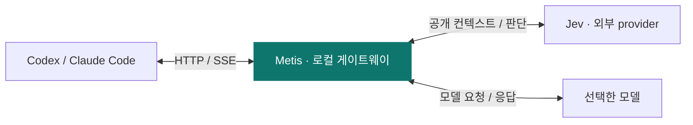

<p align="center">
  
</p>

<h1 align="center">Metis</h1>

<p align="center">Jev로 Codex와 Claude Code의 도구와 추론 강도를 판단합니다.</p>

<p align="center">
  <a href="https://github.com/gaeng2y/llm-metis/actions/workflows/ci.yml"></a>
  
  
</p>

<p align="center">
  <a href="README.md">English</a> · <a href="README.ko.md">한국어</a> · <a href="README.ja.md">日本語</a> · <a href="README.zh-CN.md">简体中文</a>
</p>

<p align="center">
  <a href="#quick-start">빠른 시작</a> · <a href="#how-it-works">동작 방식</a> · <a href="#providers">Provider</a> · <a href="#commands">명령어</a> · <a href="#reference">고급 설정</a> · <a href="#platforms">플랫폼</a>
</p>

**llm-metis**는 로컬 게이트웨이를 거쳐 터미널에서 Codex 또는 Claude Code를 실행합니다. 작업할 프로젝트 폴더에서 `metis-codex` 또는 `metis-claude`를 입력하세요. Jev는 게이트웨이의 판단 엔진으로, 클라이언트에서 선택한 모델을 유지하면서 한 번의 평가로 도구와 추론 강도(reasoning effort)를 선택합니다.

<a id="quick-start"></a>

## 빠른 시작

**시작 전 준비:** Node.js 22.15 이상과 사용 중인 플랫폼에 설치하고 로그인한 Codex CLI 또는 Claude Code가 필요합니다.

### 1. 설치하고 설정하기

macOS, Linux, Windows PowerShell에서 저장소를 내려받아 설치합니다.

```sh
git clone https://github.com/gaeng2y/llm-metis.git
cd llm-metis
npm install
npm link
metis-codex configure
```

`npm install`이 CLI를 자동으로 빌드하고, `npm link`가 `metis-codex`와 `metis-claude`를 PATH에 등록합니다. npm 레지스트리 배포 없이 사용하는 소스 설치 방식입니다. 설정 명령에서 OpenRouter, Vercel, TypeSafe 중 하나를 선택하고 API 키를 입력하면 됩니다. 키는 화면에 표시되지 않으며, `.env`를 직접 수정할 필요가 없습니다.

### 2. 코딩 클라이언트 열기

이후 작업할 프로젝트 폴더에서 원하는 명령을 실행하세요.

```sh
metis-codex
# 또는 Claude Code 실행:
metis-claude
```

각 명령은 게이트웨이를 자동으로 시작하고, 같은 터미널과 현재 폴더에서 선택한 클라이언트의 대화형 화면을 엽니다. 별도의 `--start` 단계는 필요 없습니다. 두 명령은 저장한 Jev 설정, 라우팅 제어, 대시보드를 프로젝트 간에 공유합니다. 키가 없거나 Jev가 실패하면 원래 모델 요청을 전달합니다. 키가 없을 때는 대시보드에 `Credentials: missing`과 `jev_credentials_missing`이 표시됩니다.

<a id="how-it-works"></a>

## 동작 방식



모델 인증과 도구 실행은 Codex와 Claude Code가 담당합니다. Metis는 도구와 추론 강도 각각의 신뢰도 기준을 통과한 판단만 적용하며, 불확실한 부분은 원래 요청을 유지합니다.

Jev에는 최근 공개 대화, 공개 요약, 도구 결과의 제한된 발췌, 사용 가능한 도구 정의를 전달합니다. 이미지와 암호화된 reasoning 항목은 제외합니다. **게이트웨이는 로컬에서 실행되지만, 결정 추론은 선택한 외부 provider에서 수행됩니다.**

<a id="providers"></a>

## Jev provider 선택

어느 폴더에서든 설정 명령을 실행할 수 있습니다. `metis-codex configure`와 `metis-claude configure`는 같은 설정을 수정합니다. 선택한 Jev provider의 인증 정보는 Codex 또는 Claude Code 로그인과 별개입니다.

| Provider | 선택 값 | 선택적 인증 환경변수 | 기본 모델 |
|---|---|---|---|
| [OpenRouter](https://openrouter.ai/blog/insights/what-is-jev/) (기본값) | `openrouter` | `OPENROUTER_API_KEY` | `typesafe/jev-1.13` |
| [Vercel AI Gateway](https://vercel.com/docs/ai-gateway/modalities/evaluation) | `vercel` | `AI_GATEWAY_API_KEY` | `typesafe-ai/jev` |
| [TypeSafe](https://docs.typesafe.ai/api) | `typesafe` | `TYPESAFE_API_KEY` | `jev-latest` |

[Astra-Ares의 설정 방식](https://github.com/miuuyy/Astra-Ares/blob/main/docs/configuration.md)처럼 provider를 명시적으로 선택합니다. 저장된 선택이나 환경변수 지정이 없으면 `openrouter`가 기본값입니다. 다른 키가 있어도 선택은 바뀌지 않으며 오류가 나도 다른 provider로 전환하지 않습니다. 인증 정보가 없거나 평가에 실패하면 원래 모델 요청을 유지합니다.

설정을 저장해도 실행 중인 게이트웨이를 재시작하지 않습니다. 진행 중인 작업이 끝난 뒤 재시작하고 상태를 확인하세요.

```sh
metis-codex --stop
metis-codex --start
metis-codex --status
```

`jevConfigured: true`는 키를 불러왔다는 뜻이며, 키의 유효성이나 실제 Jev 판단 성공을 검증한 것은 아닙니다. 작업 실행 후 대시보드에서 평가 성공 여부와 적용된 effort를 확인하세요.

<a id="commands"></a>

## 자주 쓰는 명령어

| 작업 | 명령어 |
|---|---|
| 게이트웨이 시작 | `metis-codex --start` |
| 상태 확인 | `metis-codex --status` |
| 대시보드 열기 | `metis-codex --dashboard` |
| 두 판단 모두 끄기 | `metis-codex --routing off` |
| 도구 판단 켜기 | `metis-codex --tool-routing on` |
| 추론 강도 판단 끄기 | `metis-codex --effort-routing off` |
| 게이트웨이 종료 | `metis-codex --stop` |

```sh
# 클라이언트 옵션과 명령은 -- 뒤에 전달합니다.
metis-codex -- --model gpt-6-astra
metis-codex -- exec --model gpt-6-astra '작업 내용을 입력하세요'
metis-claude -- --model sonnet
metis-claude -- -p '작업 내용을 입력하세요'
```

위 제어 명령은 `metis-claude`에서도 동일하게 사용할 수 있습니다. 라우팅 명령과 대시보드 변경은 실행 중인 게이트웨이의 이후 요청부터 즉시 적용됩니다. 재시작하면 저장된 설정과 환경변수를 다시 읽습니다. 환경변수, 인증 정보, upstream URL을 바꾼 뒤에는 `--stop`, `--start`를 차례로 실행하세요. 같은 상태 디렉터리를 사용하는 터미널은 게이트웨이를 공유합니다. 독립 실험은 `METIS_STATE_DIR`와 `METIS_PORT`를 모두 다르게 지정합니다.

<a id="reference"></a>

## 고급 설정과 동작 규칙

<details>
<summary>클라이언트 인증과 upstream</summary>

CLI는 `-c model_provider=…`와 provider 설정을 자신이 실행하는 Codex 프로세스에만 전달합니다. `~/.codex/config.toml`이나 로그인 파일은 수정하지 않습니다. 모델 인증과 갱신은 Codex가 담당하고, 게이트웨이는 `Authorization`과 `ChatGPT-Account-Id`를 upstream으로 전달합니다. Jev 인증 정보는 별도의 평가 요청에만 사용합니다.

읽을 수 있는 Codex `auth.json`이 ChatGPT 로그인을 나타내면 기본 upstream은 `https://chatgpt.com/backend-api/codex`이며, 그 외에는 `https://api.openai.com/v1`입니다. **키체인 전용 로그인이나 사용자 지정 provider는 `UPSTREAM_BASE_URL`을 명시하세요.** 실행 중인 게이트웨이는 로그인 방식 변경을 자동으로 따라가지 않습니다.

실행기는 HTTP/SSE 사용을 위해 해당 실행에만 `supports_websockets=false`를 설정합니다. 지원하지 않는 WebSocket 연결은 거부합니다. 이 CLI는 Codex 데스크톱 앱의 기존 작업을 자동으로 연결하지 않습니다.

Claude Code는 인증 정보가 포함된 loopback URL을 가리키는 비공개 임시 `--settings` 파일을 사용합니다. 로컬 토큰은 사용자 정의 헤더 대신 URL에 포함되며 upstream 전달 전에 제거합니다. 사용자 설정, 로그인 파일, 기존 사용자 정의 인증 헤더는 유지합니다. 게이트웨이는 `x-api-key`, `Authorization`, Anthropic version/beta 헤더를 전달하며 가짜 API 키로 교체하지 않습니다. 모델 인증은 Claude Code가 담당합니다. upstream은 기본적으로 `https://api.anthropic.com`이며, 게이트웨이 시작 시 상속한 `ANTHROPIC_BASE_URL`이 있으면 이를 사용합니다. `METIS_ANTHROPIC_BASE_URL`로 덮어쓸 수 있습니다. Bedrock, Vertex, Foundry 모드는 지원하지 않으며 해당 설정을 감지하면 실행을 거부합니다. 조직의 관리 설정은 라우팅을 덮어쓸 수 있으며 Metis는 조직 정책을 무시하지 않습니다. 실제 구독, 모델, 기업 환경 호환성은 별도 검증이 필요합니다.

</details>

<details>
<summary>저장된 설정과 환경변수</summary>

```sh
metis-codex configure
# Provider를 바로 선택한 뒤, 숨김 입력창에서 키를 입력합니다.
metis-codex configure --provider openrouter
# configure의 별칭입니다.
metis-codex configuration
# 키를 표시하지 않고 설정 파일 위치만 확인합니다.
metis-codex config-path
```

키 입력에서 Enter를 누르면 해당 provider에 저장된 기존 키를 유지합니다. OpenRouter, Vercel, TypeSafe의 키를 각각 보관하므로 provider를 바꿔도 다른 키는 지워지지 않습니다. 비밀번호 관리자나 자동화에서는 키를 명령 인자에 넣는 대신 `metis-codex configure --provider openrouter --key-stdin`에 파이프로 전달할 수 있습니다.

설정은 `~/.config/llm-metis/config.json`에 저장됩니다. Windows에서는 `%USERPROFILE%\.config\llm-metis\config.json`입니다. `XDG_CONFIG_HOME`으로 기본 설정 폴더를, `METIS_CONFIG`로 설정 파일 경로를 바꿀 수 있습니다. 파일은 Unix에서 0600, Windows에서 현재 사용자만 허용하는 DACL을 적용합니다. API 키는 저장소가 아닌 이 보호된 로컬 파일에 저장됩니다.

환경변수나 현재 폴더의 `.env`에 비어 있지 않은 provider 또는 키가 있으면 저장된 설정보다 우선합니다. 빈 키 값은 저장된 인증 정보를 가리지 않습니다. `configure`는 이런 덮어쓰기가 있으면 안내합니다. 기존 `.env` 사용자는 저장된 설정을 적용하려면 충돌하는 `METIS_PROVIDER`(이전 이름 `JEV_PROVIDER`)와 키 항목을 제거하세요. 고급 설정용 환경변수는 `.env.example`에 정리되어 있으며, 사용은 선택 사항입니다.

기존 `JEV_*` 환경변수는 같은 항목의 `METIS_*`가 없을 때 계속 읽습니다. `METIS_*`가 있으면 빈 값이어도 우선하며, provider가 빈 값이면 저장된 선택이나 기본값을 사용합니다. 새로 설정할 때는 `METIS_*` 이름을 사용하세요.

| 환경변수 | 기본값 / 설명 |
|---|---|
| `METIS_PROVIDER` | 비어 있지 않으면 저장된 provider보다 우선. 그 외에는 저장된 선택, 없으면 `openrouter`. `openrouter`, `vercel`, `typesafe` 중 선택하며 자동 전환 없음 |
| `METIS_CONFIG` | 저장할 설정 파일 경로. 상대 경로는 현재 폴더 기준으로 해석 |
| `XDG_CONFIG_HOME` | `llm-metis/config.json`을 저장할 기본 폴더. 기본값 `~/.config` |
| `METIS_MODEL`, `METIS_URL` | 선택한 provider의 평가 API 형식을 유지하며 모델과 endpoint 변경. 임의의 chat-completions endpoint는 지원하지 않음 |
| `METIS_TOOL_MIN_CONFIDENCE` | `0.85` |
| `METIS_EFFORT_MIN_CONFIDENCE` | `0.85` |
| `METIS_TIMEOUT_MS` | `2000`, 결정 전체의 최대 대기 시간, 재시도 없음 |
| `METIS_ROUTING` | `on`, 시작 시 두 라우팅을 함께 켜거나 끔 |
| `METIS_TOOL_ROUTING`, `METIS_EFFORT_ROUTING` | 각각 `on` |
| `METIS_DIRECT_CALLS` | `off`, 제한된 함수 호출 합성을 명시적으로 허용 |
| `METIS_PORT` | `8791`, 항상 `127.0.0.1`에만 바인딩 |
| `UPSTREAM_BASE_URL` | 위에서 설명한 로그인 방식에 따라 선택, URL에 인증 정보와 쿼리 매개변수 금지 |
| `METIS_STATE_DIR` | `~/.local/state/llm-metis` (Windows는 `%USERPROFILE%\.local\state\llm-metis`). 로컬 토큰 파일은 Unix에서 0600, Windows에서 현재 사용자만 허용하는 DACL 적용 |
| `METIS_CODEX_BIN` | `codex`, 네이티브 실행 파일이나 `.js` / `.mjs` / `.cjs` 진입점 경로로 변경 가능 |
| `METIS_CLAUDE_BIN` | `claude`, 위와 동일한 실행 파일/진입점 지정 지원 |
| `METIS_ANTHROPIC_BASE_URL` | Claude upstream. 기본값은 상속한 `ANTHROPIC_BASE_URL`, 없으면 `https://api.anthropic.com` |

</details>

<details>
<summary>소스 개발, 업데이트, 데스크톱 연동</summary>

소스 개발 중 `npm link` 없이 실행하려면 이 저장소에서 `node bin/metis-codex.mjs …` 또는 `node bin/metis-claude.mjs …`를 사용하세요(`npm run codex` / `npm run claude`). `llm-metis`는 `metis-codex`의 별칭입니다.

기존 저장소를 업데이트했다면 `npm install`, `npm link`를 다시 실행해 새 명령을 등록하세요. 진행 중인 작업이 끝난 뒤 `metis-codex --stop`, `metis-codex --start`를 차례로 실행합니다. 이전 기본 상태 디렉터리의 게이트웨이도 찾아서 안전하게 종료할 수 있으며, 자동으로 재시작하지는 않습니다.

Windows에서는 네이티브 `codex.exe` / `claude.exe`와 표준 npm 설치의 `codex.cmd` / `claude.cmd`를 지원합니다. npm 실행기는 셸 없이 각 공식 JavaScript 진입점을 실행합니다. `METIS_CODEX_BIN`과 `METIS_CLAUDE_BIN`에는 네이티브 실행 파일이나 `.js`, `.mjs`, `.cjs` 진입점 경로를 지정할 수 있으며, 사용자 정의 `.cmd` / `.bat` 실행기는 지원하지 않습니다.

대시보드는 macOS의 `open`, Linux의 `xdg-open`, Windows의 `rundll32`로 엽니다. Linux에서 대시보드를 열려면 데스크톱 세션과 `xdg-open`이 필요합니다.

</details>

<details>
<summary>결정 규칙</summary>

아래는 Codex Responses 라우팅 규칙입니다. Claude Messages도 같은 신뢰도 검사, 시간 제한, 원본 요청 복귀 규칙을 사용합니다. Claude effort는 요청에 `output_config.effort`가 이미 있을 때만 변경하며, 도구 강제는 모델과 thinking 제약을 따릅니다. Claude 응답은 `direct` 경로로 합성하지 않습니다. 토큰 수 계산 요청은 그대로 전달합니다.

- 도구와 effort의 임계값은 독립적입니다. 하나만 확신하면 그 부분만 변경합니다. 둘 다 불확실하면 원본 바이트를 그대로 전달합니다.
- 호출자가 지정한 `tool_choice=none`, `required`, 특정 도구, allowed-tools 설정은 보존합니다. effort는 별도로 판단할 수 있습니다.
- `forced`는 지원되는 function/custom 도구의 `tool_choice`를 설정합니다. `none`은 다음 응답의 도구 사용을 막습니다. `passthrough`는 도구 설정을 유지합니다.
- `direct`는 명시적 활성화와 `store:false`가 필요합니다. 유한한 선택지의 함수 인자를 검증하고 Responses 함수 호출을 합성합니다. **게이트웨이는 도구를 실행하지 않습니다.** 자유 텍스트 인자나 지원하지 않는 JSON Schema 제약은 주 모델에 인자 생성을 맡깁니다. JSON과 SSE 응답을 모두 지원하며, 이 경로에서는 effort를 적용하지 않습니다.
- 도구 추출은 `additional_tools`와 namespace를 지원합니다. hosted 도구와 기본 `functions` namespace 외의 도구는 후보로 고려하지만 강제하지 않습니다. 도구가 120개를 넘으면 두 번째 Jev 호출 없이 도구 라우팅을 건너뜁니다.
- `previous_response_id`, `conversation`, opaque item reference로 서버 이력이 숨겨진 요청은 평가 없이 전달합니다. `configuration_update`가 있으면 effort 변경을 건너뜁니다. `/responses/compact`도 그대로 전달합니다.
- Jev 오류, 시간 초과, 잘못된 응답은 원본 요청으로 복귀합니다. upstream이 변경된 요청을 HTTP 400/422로 거절하면 원본으로 한 번 재시도합니다. 성공한 응답이나 이미 시작된 스트림은 재시도하지 않습니다.

</details>

<details>
<summary>대시보드 데이터와 비교</summary>

프롬프트, 인자, 인증 헤더, API 키는 로그에 기록하지 않습니다. 대시보드는 요청 시점의 실험 모드, 제안 및 적용된 도구/effort, 신뢰도, Jev provider/model/지연시간/사용량, upstream 토큰/캐시/reasoning 사용량, 모델 및 전체 지연시간, 결과 상태를 메모리에 보관합니다. 원본 프롬프트와 provider 오류 본문은 보관하지 않습니다.

- 최근 요청 2,000개와 wrapper 세션 200개까지만 보관하며 재시작하면 초기화됩니다.
- 모델 지연시간은 upstream 요청부터 스트림 종료까지입니다. 원본 요청을 재시도하면 두 시도의 시간을 모두 포함합니다.
- 사용량이 없으면 0 대신 `—`로 표시합니다. `*`는 일부 요청만 사용량을 보고했다는 뜻입니다.
- direct 호출의 upstream 토큰 사용량은 0이며, Jev 사용량은 별도로 기록합니다. provider 가격을 검증하지 않았으므로 달러 비용은 계산하지 않습니다.
- 작업 시간은 `metis-codex` 또는 `metis-claude`가 실행한 클라이언트 프로세스의 전체 실행 시간입니다. 대화형 세션에서는 사용자 대기 시간도 포함합니다. 작업 비교에는 `metis-codex -- exec …` 또는 `metis-claude -- -p …`로 한 번에 한 작업씩 실행하세요. 세션 중 모드를 변경하면 작업 단위 비교의 신뢰성이 떨어집니다.
- 대시보드 토큰은 URL fragment로 전달한 뒤 주소에서 제거합니다. 제어 API와 모델 프록시 모두 별도의 로컬 토큰이 필요합니다. 외부 Origin/Host 헤더는 거부합니다.

네 모드를 비교할 때는 모델, 초기 effort, 저장소 시작 상태, 작업을 동일하게 유지하고 각 결과의 품질도 확인하세요.

| 모드 | Tool | Effort |
|---|---|---|
| baseline | off | off |
| tool-only | on | off |
| effort-only | off | on |
| tool+effort | on | on |

baseline도 게이트웨이를 거치되 두 결정을 끈 상태입니다. HIGH를 자동 설정하지 않고 요청된 effort를 유지합니다. HIGH 기준으로 비교하려면 Codex에 `-c model_reasoning_effort=high`를 전달하세요. 별도로 Codex를 직접 실행하면 프록시 자체의 오버헤드도 분리해 볼 수 있습니다.

</details>

<a id="platforms"></a>

## 플랫폼과 검증

Linux 데스크톱 PC, Apple Silicon Mac, 네이티브 Windows 10/11 x64 PC를 대상으로 합니다. Node.js 22.15 이상과 같은 플랫폼용으로 설치하고 로그인한 Codex CLI 또는 Claude Code가 필요합니다. 게이트웨이는 외부 런타임 의존성 없는 JavaScript로 빌드되므로, Apple Silicon에서는 네이티브 arm64 Node.js로 Rosetta나 네이티브 프로젝트 빌드 없이 실행합니다. 최초 설계, 참고 커밋, 구현 순서와 위험 요소는 [설계 문서](docs/architecture.md), 수행한 검사와 한계는 [검증 기록](docs/validation.md)에 있습니다. 두 문서는 영어로 제공됩니다.

CI는 아래 GitHub 호스팅 러너에서 Node.js `22.15.0`과 `24`를 사용합니다. `windows-2022`는 Windows Server 2022 테스트 환경을 뜻하며, 사용자에게 Windows Server가 필요한 것은 아닙니다.

| 사용자 플랫폼 | CI 러너 | 아키텍처 |
|---|---|---|
| Linux 데스크톱 | `ubuntu-24.04` | x64 |
| Apple Silicon macOS | `macos-15` | arm64 |
| Windows 10/11 | `windows-2022` | x64 |

CI는 자동화된 동작을 검사합니다. Windows 10/11에서의 설치, 대화형 키 입력, 브라우저 열기, 설치된 Codex/Claude Code 연동은 별도 데스크톱 검증이 필요합니다. 수행한 검사와 한계는 [검증 기록](docs/validation.md)에 있습니다.

<details>
<summary>검사 실행과 검증 범위</summary>

```sh
npm run typecheck
npm test
# 선택: 임시 HOME, 가짜 키, 로컬 provider로 설치된 클라이언트를 점검합니다.
npm run test:codex
npm run test:claude
```

Node 기본 테스트 러너와 로컬 가짜 provider/upstream을 사용합니다. 실제 인증 정보나 유료 추론 없이 신뢰도 조합, 오류·시간 초과 복구, 도구 없음, 호출자 설정 보존, 인증 전달, 압축 원본 재전송, SSE, provider별 typed 요청, CLI 생명주기, 기존 설정 불변을 검사합니다. loopback 포트를 열 수 있는 환경이 필요합니다.

실제 Jev 응답, ChatGPT/Claude 구독 backend 연결, 모델 호환성, 토큰 절감, 장기 세션의 캐시 효율은 별도 라이브 검증이 필요합니다. HTTP effort 변경은 [Astra-Ares](https://github.com/miuuyy/Astra-Ares)의 native checkpoint와 prefix 보존 방식과 동등하지 않습니다. Lease, Codex 패치, Laya 엔진, 모델 라우팅, 도구 family 라우팅, MCP grouping은 구현하지 않았습니다. 이후 `DecisionEngine` 구현을 교체할 수 있습니다.

</details>

참고: [jev-gateway](https://github.com/vinilana/jev-gateway), [Astra-Ares](https://github.com/miuuyy/Astra-Ares), [Codex provider 설정](https://learn.chatgpt.com/docs/config-file/config-reference). 참고 저장소를 의존성으로 추가하거나 코드베이스 전체를 복사하지 않은 독립 구현입니다.
