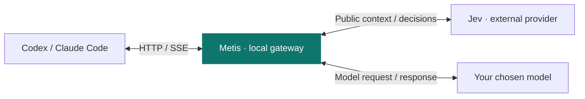

<p align="center">
  
</p>

<h1 align="center">Metis</h1>

<p align="center">Jev-powered tool and reasoning decisions for Codex and Claude Code.</p>

<p align="center">
  <a href="https://github.com/gaeng2y/llm-metis/actions/workflows/ci.yml"></a>
  
  
</p>

<p align="center">
  <a href="README.md">English</a> · <a href="README.ko.md">한국어</a> · <a href="README.ja.md">日本語</a> · <a href="README.zh-CN.md">简体中文</a>
</p>

<p align="center">
  <a href="#quick-start">Quick start</a> · <a href="#how-it-works">How it works</a> · <a href="#providers">Providers</a> · <a href="#commands">Commands</a> · <a href="#reference">Reference</a> · <a href="#platforms">Platforms</a>
</p>

**llm-metis** launches Codex or Claude Code in your terminal through a local gateway. Run `metis-codex` or `metis-claude` from your project directory. Jev is the gateway's decision engine: one evaluation selects tools and reasoning effort while preserving the client's chosen model.

<a id="quick-start"></a>

## Quick start

**Before you start:** Node.js 22.15 or later, plus Codex CLI or Claude Code installed and authenticated for your platform.

### 1. Install and configure

Install from a checkout on macOS, Linux, or Windows PowerShell:

```sh
git clone https://github.com/gaeng2y/llm-metis.git
cd llm-metis
npm install
npm link
metis-codex configure
```

`npm install` builds the CLI automatically. `npm link` makes `metis-codex` and `metis-claude` available on your PATH. This is a source installation; an npm registry release is not required. The configuration command asks you to choose OpenRouter, Vercel, or TypeSafe and enter its API key without displaying it. No `.env` editing is needed.

### 2. Open your coding client

Then run either command from the project you want to work on:

```sh
metis-codex
# Or open Claude Code:
metis-claude
```

Each command starts the gateway automatically and opens the selected client interactively in the same terminal and current directory. No separate `--start` step is needed. Both commands share the saved Jev settings, routing controls, and dashboard across projects. If credentials are missing or Jev fails, the gateway forwards the original model request. The dashboard shows `Credentials: missing` and `jev_credentials_missing` when no key is configured.

<a id="how-it-works"></a>

## How it works



Codex and Claude Code keep their model authentication and execute their own tools. Metis applies tool and effort decisions only when the corresponding confidence gate passes; uncertain decisions leave that part of the request unchanged.

Jev receives recent public conversation context, public summaries, bounded excerpts of tool results, and available tool definitions. Images and encrypted reasoning items are excluded. **The gateway runs locally, but decision inference runs at the selected external provider.**

<a id="providers"></a>

## Choose your Jev provider

Run the configuration command from any directory. Use `metis-codex configure` or `metis-claude configure`; both update the same settings. The selected Jev provider's credentials are separate from your Codex or Claude Code login.

| Provider | Selection | Optional credential environment variable | Default model |
|---|---|---|---|
| [OpenRouter](https://openrouter.ai/blog/insights/what-is-jev/) (default) | `openrouter` | `OPENROUTER_API_KEY` | `typesafe/jev-1.13` |
| [Vercel AI Gateway](https://vercel.com/docs/ai-gateway/modalities/evaluation) | `vercel` | `AI_GATEWAY_API_KEY` | `typesafe-ai/jev` |
| [TypeSafe](https://docs.typesafe.ai/api) | `typesafe` | `TYPESAFE_API_KEY` | `jev-latest` |

Provider selection is explicit, following [Astra-Ares's configuration approach](https://github.com/miuuyy/Astra-Ares/blob/main/docs/configuration.md). Without a saved or environment-selected provider, the default is `openrouter`. Other configured keys never change the selection, including after an error. Missing credentials or evaluation failures preserve the original model request.

Saving configuration does not restart a running gateway. Let active tasks finish, then restart it and check its status:

```sh
metis-codex --stop
metis-codex --start
metis-codex --status
```

`jevConfigured: true` confirms that a key was loaded; it does not verify the key or a live Jev decision. Check the dashboard after a task for successful evaluation and applied effort.

<a id="commands"></a>

## Everyday commands

| Action | Command |
|---|---|
| Start the gateway | `metis-codex --start` |
| Check status | `metis-codex --status` |
| Open the dashboard | `metis-codex --dashboard` |
| Turn both decisions off | `metis-codex --routing off` |
| Enable tool decisions | `metis-codex --tool-routing on` |
| Disable effort decisions | `metis-codex --effort-routing off` |
| Stop the gateway | `metis-codex --stop` |

```sh
# Pass client options and commands after --.
metis-codex -- --model gpt-6-astra
metis-codex -- exec --model gpt-6-astra 'Describe your task here'
metis-claude -- --model sonnet
metis-claude -- -p 'Describe your task here'
```

All control commands above also work with `metis-claude`. Routing commands and dashboard changes apply immediately to subsequent requests handled by the running gateway. Restarting reloads the saved configuration and environment settings. Run `--stop` followed by `--start` after changing environment variables, credentials, or the upstream URL. Terminals using the same state directory share one gateway. Set different values for both `METIS_STATE_DIR` and `METIS_PORT` to run independent experiments.

<a id="reference"></a>

## Advanced reference

<details>
<summary>Client authentication and upstreams</summary>

The CLI passes `-c model_provider=…` and provider settings only to the Codex process it launches. It does not modify `~/.codex/config.toml` or login files. Codex owns model authentication and credential refresh; the gateway forwards `Authorization` and `ChatGPT-Account-Id` to the upstream. Jev credentials are used only for separate evaluator requests.

If the readable Codex `auth.json` identifies a ChatGPT login, the default upstream is `https://chatgpt.com/backend-api/codex`. Otherwise, it is `https://api.openai.com/v1`. **Set `UPSTREAM_BASE_URL` explicitly for keychain-only logins or custom providers.** A running gateway does not automatically follow changes to the login method.

The launcher sets `supports_websockets=false` for that invocation to use HTTP/SSE. Unsupported WebSocket connections are rejected. This CLI does not automatically connect existing tasks in the Codex desktop app.

Claude Code uses a private temporary `--settings` file pointing to an authenticated loopback URL. The local token is part of that URL, not a custom header, and is removed before forwarding upstream. User settings, login files, and existing custom authentication headers are preserved. The gateway forwards `x-api-key`, `Authorization`, and Anthropic version/beta headers without substituting a dummy API key. Model authentication remains with Claude Code. The upstream defaults to `https://api.anthropic.com`, or `ANTHROPIC_BASE_URL` inherited when the gateway starts; `METIS_ANTHROPIC_BASE_URL` overrides it. Bedrock, Vertex, and Foundry modes are unsupported and detected configurations are rejected. Managed settings can override routing; Metis does not override organizational policy. Live subscription, model, and enterprise compatibility still require validation.

</details>

<details>
<summary>Saved settings and environment variables</summary>

```sh
metis-codex configure
# Select a provider directly, then enter its key at the hidden prompt.
metis-codex configure --provider openrouter
# Alias for configure.
metis-codex configuration
# Print the configuration file location without revealing keys.
metis-codex config-path
```

Press Enter at the key prompt to keep an existing saved key for that provider. Keys are retained separately for OpenRouter, Vercel, and TypeSafe, so switching providers does not erase the others. For password managers or automation, pipe the key into `metis-codex configure --provider openrouter --key-stdin` instead of placing it in command arguments.

Settings are saved in `~/.config/llm-metis/config.json` (`%USERPROFILE%\.config\llm-metis\config.json` on Windows). `XDG_CONFIG_HOME` changes the base configuration directory; `METIS_CONFIG` overrides the file location. The file uses mode 0600 on Unix and a current-user-only DACL on Windows. API keys are stored locally in this protected file, not in the repository.

Nonblank provider and key values in the environment or the current directory's `.env` override saved settings. Blank placeholders do not hide saved credentials. `configure` warns when such overrides are present. Existing `.env` users should remove conflicting `METIS_PROVIDER` (or legacy `JEV_PROVIDER`) and key entries to use the saved configuration. For advanced settings, `.env.example` documents the available environment variables; using it is optional.

Legacy `JEV_*` environment names remain readable when the corresponding `METIS_*` name is unset. A `METIS_*` value takes precedence even when empty; an empty provider value uses the saved selection or default. New setups should use `METIS_*` names.

| Environment variable | Default / description |
|---|---|
| `METIS_PROVIDER` | Nonblank values override the saved provider; otherwise use the saved selection, then `openrouter`. Select `openrouter`, `vercel`, or `typesafe`; no automatic switching |
| `METIS_CONFIG` | Override the saved configuration file path; relative paths are resolved from the current directory |
| `XDG_CONFIG_HOME` | Base directory for `llm-metis/config.json`; defaults to `~/.config` |
| `METIS_MODEL`, `METIS_URL` | Override the model and endpoint using the selected provider's evaluation API format; arbitrary chat-completions endpoints are not supported |
| `METIS_TOOL_MIN_CONFIDENCE` | `0.85` |
| `METIS_EFFORT_MIN_CONFIDENCE` | `0.85` |
| `METIS_TIMEOUT_MS` | `2000`; deadline for the entire decision, with no retries |
| `METIS_ROUTING` | `on`; enables or disables both routing decisions at startup |
| `METIS_TOOL_ROUTING`, `METIS_EFFORT_ROUTING` | Both default to `on` |
| `METIS_DIRECT_CALLS` | `off`; opt in to restricted function-call synthesis |
| `METIS_PORT` | `8791`; always binds only to `127.0.0.1` |
| `UPSTREAM_BASE_URL` | Selected from the login method as described above; credentials and query parameters are not allowed in the URL |
| `METIS_STATE_DIR` | `~/.local/state/llm-metis` (`%USERPROFILE%\.local\state\llm-metis` on Windows); the local token file uses mode 0600 on Unix and a current-user-only DACL on Windows |
| `METIS_CODEX_BIN` | `codex`; override with a native executable or a `.js` / `.mjs` / `.cjs` entry point |
| `METIS_CLAUDE_BIN` | `claude`; the same executable/entry-point options as above |
| `METIS_ANTHROPIC_BASE_URL` | Claude upstream; defaults to inherited `ANTHROPIC_BASE_URL`, then `https://api.anthropic.com` |

</details>

<details>
<summary>Source development, upgrades, and desktop integration</summary>

For source development without `npm link`, use `node bin/metis-codex.mjs …` or `node bin/metis-claude.mjs …` from this checkout (`npm run codex` / `npm run claude`). `llm-metis` remains an alias for `metis-codex`.

When upgrading an existing checkout, run `npm install` and `npm link` again to register the new command. Let active tasks finish, then run `metis-codex --stop` followed by `metis-codex --start`. The CLI recognizes an older gateway in the previous default state directory so it can be stopped safely; it does not restart it automatically.

On Windows, native `codex.exe` / `claude.exe` and the standard npm installations' `codex.cmd` / `claude.cmd` are supported. npm launchers use their official JavaScript entry points without a shell. `METIS_CODEX_BIN` and `METIS_CLAUDE_BIN` can also point to native executables or `.js`, `.mjs`, or `.cjs` entry points; custom `.cmd` / `.bat` launchers are not supported.

The dashboard opens with `open` on macOS, `xdg-open` on Linux, and `rundll32` on Windows. Linux dashboard opening requires a desktop session and `xdg-open`.

</details>

<details>
<summary>Decision policy</summary>

The rules below describe Codex Responses routing. Claude Messages uses the same confidence gates, timeout, and original-request fallback. Claude effort changes only when the request already includes `output_config.effort`; tool forcing respects model and thinking restrictions. Claude responses are never synthesized through the `direct` path. Token-count requests are forwarded unchanged.

- Tool and effort thresholds are independent. If only one decision is confident, only that part changes. If neither is confident, the original bytes are forwarded unchanged.
- Caller settings such as `tool_choice=none`, `required`, a specific tool, or allowed-tools are preserved. Effort can still be evaluated independently.
- `forced` sets `tool_choice` for a supported function/custom tool. `none` disables tool use for the next response. `passthrough` leaves the tool setting unchanged.
- `direct` requires explicit opt-in and `store:false`. It validates function arguments from finite sets and synthesizes a Responses function call. **The gateway never executes tools.** Free-text arguments or unsupported JSON Schema constraints leave argument generation to the main model. Both JSON and SSE responses are supported. Effort is not applied on this path.
- Tool extraction supports `additional_tools` and namespaces. Hosted tools and tools outside the default `functions` namespace are considered as candidates but are not forced. More than 120 tools skips tool routing without adding a second Jev call.
- Requests with hidden server history through `previous_response_id`, `conversation`, or opaque item references are forwarded without evaluation. A `configuration_update` skips effort rewriting. `/responses/compact` is also forwarded unchanged.
- Jev errors, timeouts, or invalid answers fall back to the original request. If the upstream rejects a rewrite with HTTP 400/422, the gateway retries once with the original request. Successful responses and streams that have already started are never retried.

</details>

<details>
<summary>Dashboard data and comparisons</summary>

Prompts, arguments, authentication headers, and API keys are not logged. The dashboard retains request-time experiment modes, proposed and applied tool/effort decisions, confidence, Jev provider/model/latency/usage, upstream token/cache/reasoning usage, model and total latency, and outcome status in memory. Raw prompts and provider error bodies are not retained.

- Retention is limited to the latest 2,000 requests and 200 wrapper sessions. Restarting clears the data.
- Model latency runs from the upstream request until the stream ends. If the original request is retried, it includes both attempts.
- Missing usage appears as `—`, not zero. `*` indicates that only some requests reported usage.
- Direct calls use zero upstream tokens; Jev usage is recorded separately. Dollar costs are not calculated because provider pricing has not been verified.
- Task duration is the total lifetime of the client process launched by `metis-codex` or `metis-claude`. It includes user wait time in interactive sessions. For task comparisons, run one task per invocation with `metis-codex -- exec …` or `metis-claude -- -p …`. Changing modes during a session makes its task-level comparison unreliable.
- The dashboard token is passed in a URL fragment, then removed from the address. Both the control API and model proxy require a separate local token. Foreign Origin/Host headers are rejected.

To compare the four modes, use the same model, initial effort, repository starting state, and task. Check the quality of each result as well.

| Mode | Tool | Effort |
|---|---|---|
| baseline | off | off |
| tool-only | on | off |
| effort-only | off | on |
| tool+effort | on | on |

Baseline still passes through the gateway with both decisions disabled. It preserves the requested effort rather than automatically setting HIGH. For a HIGH baseline, pass `-c model_reasoning_effort=high` to Codex. A separate direct Codex run can help isolate the proxy's own overhead.

</details>

<a id="platforms"></a>

## Platforms and validation

Targets Linux desktop PCs, Apple Silicon Macs, and native Windows 10/11 x64 PCs. Requires Node.js 22.15 or later and the client you want to use—Codex CLI or Claude Code—installed and authenticated for the same platform. The gateway builds to plain JavaScript with no external runtime dependencies; native arm64 Node.js runs it on Apple Silicon without Rosetta or a native project build. See the [architecture proposal](docs/architecture.md) for the original design, reference commits, implementation order, and risks, and the [validation record](docs/validation.md) for completed checks and their limits.

The CI workflow uses Node.js `22.15.0` and `24` on the following GitHub-hosted runners. `windows-2022` is the Windows Server 2022 test environment; users do not need Windows Server.

| User platform | CI runner | Architecture |
|---|---|---|
| Linux desktop | `ubuntu-24.04` | x64 |
| macOS on Apple Silicon | `macos-15` | arm64 |
| Windows 10/11 | `windows-2022` | x64 |

CI checks automated behavior. Installation, interactive key entry, browser opening, and installed Codex/Claude Code integration on Windows 10/11 require separate desktop validation. See the [validation record](docs/validation.md) for completed checks and their limits.

<details>
<summary>Run checks and understand their limits</summary>

```sh
npm run typecheck
npm test
# Optional: check installed clients with a temporary HOME, fake keys, and local providers.
npm run test:codex
npm run test:claude
```

Tests use Node's built-in test runner and local fake providers/upstreams. Without real credentials or paid inference, they cover confidence combinations, timeout/error fallback, missing tools, caller-setting preservation, authentication passthrough, compressed original-body replay, SSE, provider-specific typed requests, CLI lifecycle, and unchanged normal configuration. The environment must permit loopback listeners.

Real Jev responses, ChatGPT/Claude subscription backend acceptance, model compatibility, token savings, and long-session cache efficiency require separate live validation. HTTP effort rewriting is not equivalent to [Astra-Ares](https://github.com/miuuyy/Astra-Ares)'s native checkpoint and prefix preservation. Leases, Codex patches, a Laya engine, model routing, tool-family routing, and MCP grouping are not implemented. The `DecisionEngine` implementation can be replaced later.

</details>

References: [jev-gateway](https://github.com/vinilana/jev-gateway), [Astra-Ares](https://github.com/miuuyy/Astra-Ares), and [Codex provider configuration](https://learn.chatgpt.com/docs/config-file/config-reference). This is an independent implementation; the reference repositories are not dependencies, and their codebases were not copied wholesale.
