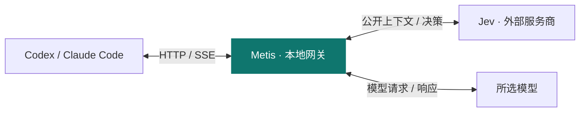

<p align="center">
  
</p>

<h1 align="center">Metis</h1>

<p align="center">由 Jev 为 Codex 和 Claude Code 决定工具选择与推理强度。</p>

<p align="center">
  <a href="https://github.com/gaeng2y/llm-metis/actions/workflows/ci.yml"></a>
  
  
</p>

<p align="center">
  <a href="README.md">English</a> · <a href="README.ko.md">한국어</a> · <a href="README.ja.md">日本語</a> · <a href="README.zh-CN.md">简体中文</a>
</p>

<p align="center">
  <a href="#quick-start">快速开始</a> · <a href="#how-it-works">工作原理</a> · <a href="#providers">服务商</a> · <a href="#commands">命令</a> · <a href="#reference">高级配置</a> · <a href="#platforms">平台</a>
</p>

**llm-metis** 通过本地网关，在终端中启动 Codex 或 Claude Code。在项目目录运行 `metis-codex` 或 `metis-claude` 即可。Jev 是网关的决策引擎，通过一次评估选择工具和推理强度（reasoning effort），同时保留客户端中选择的模型。

<a id="quick-start"></a>

## 快速开始

**开始之前：**需要 Node.js 22.15 或更高版本，以及在当前平台上已安装并完成认证的 Codex CLI 或 Claude Code。

### 1. 安装并配置

在 macOS、Linux 或 Windows PowerShell 中从仓库安装：

```sh
git clone https://github.com/gaeng2y/llm-metis.git
cd llm-metis
npm install
npm link
metis-codex configure
```

`npm install` 会自动构建 CLI，`npm link` 将 `metis-codex` 和 `metis-claude` 注册到 PATH。这是从源码安装，无需 npm 注册表发布。配置命令会让你选择 OpenRouter、Vercel 或 TypeSafe，并输入 API 密钥。输入的密钥不会显示在屏幕上，无需手动编辑 `.env`。

### 2. 启动编程客户端

随后，在需要处理的项目目录运行所需的命令：

```sh
metis-codex
# 或启动 Claude Code：
metis-claude
```

每个命令都会自动启动网关，并在同一终端和当前目录打开所选客户端的交互界面。无需单独运行 `--start`。两个命令跨项目共享保存的 Jev 设置、路由控制和仪表盘。如果缺少凭据或 Jev 调用失败，网关会转发原始模型请求。未配置密钥时，仪表盘会显示 `Credentials: missing` 和 `jev_credentials_missing`。

<a id="how-it-works"></a>

## 工作原理



模型认证和工具执行由 Codex 与 Claude Code 负责。Metis 仅应用分别达到置信度要求的工具与推理强度决策，不确定的部分保留原始请求。

Jev 会收到最近的公开对话上下文、公开摘要、长度受限的工具结果摘录，以及可用工具定义。图片和加密的 reasoning 项会被排除。**网关在本地运行，但决策推理由所选的外部服务商执行。**

<a id="providers"></a>

## 选择 Jev 服务商

可以在任何目录运行配置命令。`metis-codex configure` 和 `metis-claude configure` 修改同一份设置。所选 Jev 服务商的凭据与 Codex 或 Claude Code 登录分开配置。

| 服务商 | 选择值 | 可选凭据环境变量 | 默认模型 |
|---|---|---|---|
| [OpenRouter](https://openrouter.ai/blog/insights/what-is-jev/)（默认） | `openrouter` | `OPENROUTER_API_KEY` | `typesafe/jev-1.13` |
| [Vercel AI Gateway](https://vercel.com/docs/ai-gateway/modalities/evaluation) | `vercel` | `AI_GATEWAY_API_KEY` | `typesafe-ai/jev` |
| [TypeSafe](https://docs.typesafe.ai/api) | `typesafe` | `TYPESAFE_API_KEY` | `jev-latest` |

与 [Astra-Ares 的配置方式](https://github.com/miuuyy/Astra-Ares/blob/main/docs/configuration.md)类似，服务商需要显式选择。如果既没有保存的选择，也没有环境变量指定，则默认使用 `openrouter`。其他已配置的密钥不会改变选择，发生错误时也不会切换服务商。缺少凭据或评估失败时，保留原始模型请求。

保存配置不会重启正在运行的网关。请等待当前任务完成，再重启并检查状态：

```sh
metis-codex --stop
metis-codex --start
metis-codex --status
```

`jevConfigured: true` 仅表示已加载密钥，并不代表密钥有效或实际 Jev 决策已成功。执行任务后，请在仪表盘中检查评估是否成功以及实际应用的 effort。

<a id="commands"></a>

## 常用命令

| 操作 | 命令 |
|---|---|
| 启动网关 | `metis-codex --start` |
| 查看状态 | `metis-codex --status` |
| 打开仪表盘 | `metis-codex --dashboard` |
| 关闭两种决策 | `metis-codex --routing off` |
| 启用工具决策 | `metis-codex --tool-routing on` |
| 关闭推理强度决策 | `metis-codex --effort-routing off` |
| 停止网关 | `metis-codex --stop` |

```sh
# 将客户端选项和命令放在 -- 后面。
metis-codex -- --model gpt-6-astra
metis-codex -- exec --model gpt-6-astra '在此描述你的任务'
metis-claude -- --model sonnet
metis-claude -- -p '在此描述你的任务'
```

上述控制命令同样适用于 `metis-claude`。路由命令和仪表盘中的修改会立即应用于网关后续处理的请求。重启后重新读取保存的配置和环境变量。修改环境变量、凭据或 upstream URL 后，请依次运行 `--stop` 和 `--start`。使用同一状态目录的终端共享一个网关。如需独立实验，请为 `METIS_STATE_DIR` 和 `METIS_PORT` 分别设置不同的值。

<a id="reference"></a>

## 高级配置与行为说明

<details>
<summary>客户端认证与 upstream</summary>

CLI 仅将 `-c model_provider=…` 和服务商配置传给它启动的 Codex 进程，不会修改 `~/.codex/config.toml` 或登录文件。模型认证和凭据刷新由 Codex 负责；网关将 `Authorization` 和 `ChatGPT-Account-Id` 转发至 upstream。Jev 凭据仅用于单独的评估请求。

如果可读取的 Codex `auth.json` 表明使用 ChatGPT 登录，默认 upstream 为 `https://chatgpt.com/backend-api/codex`；否则为 `https://api.openai.com/v1`。**如果登录凭据仅存储在钥匙串中，或使用自定义服务商，请显式设置 `UPSTREAM_BASE_URL`。** 正在运行的网关不会自动跟随登录方式的变化。

启动器仅为本次运行设置 `supports_websockets=false`，以使用 HTTP/SSE。不支持的 WebSocket 连接会被拒绝。此 CLI 不会自动连接 Codex 桌面应用中已有的任务。

Claude Code 使用私有临时 `--settings` 文件，指向带认证信息的回环 URL。本地令牌包含在 URL 中，而不是自定义请求头中，并在转发至 upstream 前移除。用户设置、登录文件和现有自定义认证请求头保持不变。网关转发 `x-api-key`、`Authorization` 和 Anthropic version/beta 请求头，不会替换成虚假 API 密钥。模型认证由 Claude Code 负责。upstream 默认使用网关启动时继承的 `ANTHROPIC_BASE_URL`，未设置时使用 `https://api.anthropic.com`；可通过 `METIS_ANTHROPIC_BASE_URL` 覆盖。不支持 Bedrock、Vertex 或 Foundry 模式，检测到这些配置时会拒绝启动。组织的托管设置可能覆盖路由，Metis 不会绕过组织策略。真实订阅、模型和企业环境兼容性仍需单独验证。

</details>

<details>
<summary>已保存的设置与环境变量</summary>

```sh
metis-codex configure
# 直接选择服务商，然后在隐藏输入提示中输入密钥。
metis-codex configure --provider openrouter
# configure 的别名。
metis-codex configuration
# 查看配置文件位置，不显示密钥。
metis-codex config-path
```

在密钥提示中按 Enter，可保留该服务商已保存的密钥。OpenRouter、Vercel 和 TypeSafe 的密钥分别保存，切换服务商不会删除其他密钥。使用密码管理器或自动化时，可将密钥通过管道传给 `metis-codex configure --provider openrouter --key-stdin`，无需将密钥放入命令参数。

设置保存在 `~/.config/llm-metis/config.json`（Windows 为 `%USERPROFILE%\.config\llm-metis\config.json`）。可通过 `XDG_CONFIG_HOME` 更改配置基础目录，或通过 `METIS_CONFIG` 更改文件位置。文件在 Unix 上使用 0600 权限，在 Windows 上使用仅允许当前用户访问的 DACL。API 密钥保存在这个受保护的本地文件中，不在仓库内。

环境变量或当前目录的 `.env` 中非空的服务商或密钥值优先于已保存的设置。空密钥值不会覆盖已保存的凭据。存在这些覆盖项时，`configure` 会提示。已有 `.env` 的用户若要使用保存的配置，应删除冲突的 `METIS_PROVIDER`（旧名称 `JEV_PROVIDER`）和密钥项。高级设置可参考 `.env.example` 中的环境变量，使用它是可选的。

对应的 `METIS_*` 未设置时，仍会读取旧的 `JEV_*` 环境变量。`METIS_*` 即使为空也优先；服务商值为空时使用保存的选择或默认值。新配置应使用 `METIS_*` 名称。

| 环境变量 | 默认值 / 说明 |
|---|---|
| `METIS_PROVIDER` | 非空值覆盖保存的服务商；否则使用保存的选择，没有则为 `openrouter`。可选 `openrouter`、`vercel` 或 `typesafe`，不自动切换 |
| `METIS_CONFIG` | 覆盖保存配置的文件路径；相对路径从当前目录解析 |
| `XDG_CONFIG_HOME` | `llm-metis/config.json` 的基础目录，默认为 `~/.config` |
| `METIS_MODEL`, `METIS_URL` | 使用所选服务商的评估 API 格式覆盖模型和端点；不支持任意 chat-completions 端点 |
| `METIS_TOOL_MIN_CONFIDENCE` | `0.85` |
| `METIS_EFFORT_MIN_CONFIDENCE` | `0.85` |
| `METIS_TIMEOUT_MS` | `2000`；整个决策过程的等待时限，不重试 |
| `METIS_ROUTING` | `on`；启动时同时启用或禁用两种路由决策 |
| `METIS_TOOL_ROUTING`, `METIS_EFFORT_ROUTING` | 均默认为 `on` |
| `METIS_DIRECT_CALLS` | `off`；需显式启用受限的函数调用合成 |
| `METIS_PORT` | `8791`；始终仅绑定 `127.0.0.1` |
| `UPSTREAM_BASE_URL` | 按上述登录方式选择；URL 中不允许包含凭据和查询参数 |
| `METIS_STATE_DIR` | `~/.local/state/llm-metis`（Windows 为 `%USERPROFILE%\.local\state\llm-metis`）；本地令牌文件在 Unix 上使用 0600 权限，在 Windows 上使用仅允许当前用户访问的 DACL |
| `METIS_CODEX_BIN` | `codex`；可覆盖为原生可执行文件或 `.js` / `.mjs` / `.cjs` 入口路径 |
| `METIS_CLAUDE_BIN` | `claude`；支持与上面相同的可执行文件/入口设置 |
| `METIS_ANTHROPIC_BASE_URL` | Claude upstream；默认使用继承的 `ANTHROPIC_BASE_URL`，未设置时为 `https://api.anthropic.com` |

</details>

<details>
<summary>源码开发、更新与桌面集成</summary>

源码开发时如不使用 `npm link`，也可在此仓库中执行 `node bin/metis-codex.mjs …` 或 `node bin/metis-claude.mjs …`（`npm run codex` / `npm run claude`）。`llm-metis` 仍是 `metis-codex` 的别名。

更新已有仓库后，请重新运行 `npm install` 和 `npm link` 来注册新命令。当前任务结束后，依次运行 `metis-codex --stop` 和 `metis-codex --start`。CLI 也能识别旧默认状态目录中的网关并安全停止它，但不会自动重启。

Windows 支持原生 `codex.exe` / `claude.exe` 和标准 npm 安装生成的 `codex.cmd` / `claude.cmd`。npm 启动器直接执行各自的官方 JavaScript 入口，不经过 shell。`METIS_CODEX_BIN` 和 `METIS_CLAUDE_BIN` 也可指定原生可执行文件或 `.js`、`.mjs`、`.cjs` 入口路径；不支持自定义 `.cmd` / `.bat` 启动器。

仪表盘通过 macOS 的 `open`、Linux 的 `xdg-open` 或 Windows 的 `rundll32` 打开。在 Linux 上打开仪表盘需要桌面会话和 `xdg-open`。

</details>

<details>
<summary>决策规则</summary>

以下规则描述 Codex Responses 路由。Claude Messages 使用相同的置信度检查、超时和原始请求回退机制。仅在请求已包含 `output_config.effort` 时修改 Claude effort；强制工具选择遵守模型和 thinking 限制。Claude 响应不会通过 `direct` 路径合成。token 计数请求原样转发。

- 工具和 effort 的阈值相互独立。如果只有一项决策达到置信度要求，就只修改该部分。如果两项都不确定，则按原始字节转发请求。
- 保留调用方指定的 `tool_choice=none`、`required`、特定工具或 allowed-tools 设置。effort 仍可独立评估。
- `forced` 为支持的 function/custom 工具设置 `tool_choice`。`none` 禁止下一次响应使用工具。`passthrough` 保持工具设置不变。
- `direct` 需要显式启用，并要求 `store:false`。它验证取值来自有限集合的函数参数，然后合成 Responses 函数调用。**网关本身不执行工具。** 如果参数包含自由文本或不支持的 JSON Schema 约束，则由主模型生成参数。支持 JSON 和 SSE 响应，此路径不应用 effort。
- 工具提取支持 `additional_tools` 和 namespace。hosted 工具以及默认 `functions` namespace 之外的工具会作为候选项考虑，但不会强制指定。工具超过120个时，跳过工具路由，不增加第二次 Jev 调用。
- 如果请求通过 `previous_response_id`、`conversation` 或 opaque item reference 引用了不可见的服务器端历史，则不进行评估，直接转发。存在 `configuration_update` 时跳过 effort 改写。`/responses/compact` 也原样转发。
- Jev 报错、超时或返回无效答案时，回退到原始请求。如果 upstream 以 HTTP 400/422 拒绝改写后的请求，网关会用原始请求重试一次。成功的响应或已经开始的流不会重试。

</details>

<details>
<summary>仪表盘数据与比较</summary>

不会记录提示词、参数、认证头或 API 密钥。仪表盘在内存中保留请求发生时的实验模式、建议和已应用的工具/effort 决策、置信度、Jev 服务商/模型/延迟/用量、upstream 的 token/缓存/推理用量、模型和总请求延迟，以及结果状态。不保留原始提示词或服务商错误正文。

- 最多保留最近2,000个请求和200个包装器会话。重启会清空数据。
- 模型延迟从发送 upstream 请求开始，到流结束为止。如果重试了原始请求，则包含两次尝试的时间。
- 缺失的用量显示为 `—`，而不是零。`*` 表示只有部分请求报告了用量。
- direct 调用的 upstream token 用量为零，Jev 用量单独记录。由于尚未核实服务商价格，不计算美元成本。
- 任务耗时是 `metis-codex` 或 `metis-claude` 启动的客户端进程的完整运行时间。交互式会话还包括等待用户的时间。比较任务时，请用 `metis-codex -- exec …` 或 `metis-claude -- -p …` 每次只运行一个任务。在会话中途切换模式会降低任务级比较的可靠性。
- 仪表盘令牌通过 URL fragment 传递，随后从地址中移除。控制 API 和模型代理都需要单独的本地令牌。外部 Origin/Host 请求头会被拒绝。

比较四种模式时，请使用相同的模型、初始 effort、仓库起始状态和任务，同时检查每次运行的结果质量。

| 模式 | Tool | Effort |
|---|---|---|
| baseline | off | off |
| tool-only | on | off |
| effort-only | off | on |
| tool+effort | on | on |

baseline 仍然经过网关，只是禁用了两种决策。它保留请求中的 effort，不会自动设为 HIGH。如需以 HIGH 为基准，请向 Codex 传入 `-c model_reasoning_effort=high`。另外直接运行一次 Codex，有助于单独测量代理本身的开销。

</details>

<a id="platforms"></a>

## 平台与验证

面向 Linux 桌面 PC、Apple Silicon Mac 和原生 Windows 10/11 x64 PC。需要 Node.js 22.15 或更高版本，以及为同一平台安装并完成认证的 Codex CLI 或 Claude Code。网关编译为无外部运行时依赖的 JavaScript，因此在 Apple Silicon 上使用原生 arm64 Node.js 即可运行，无需 Rosetta 或原生项目构建。最初的设计、参考提交、实现顺序和风险见[架构提案](docs/architecture.md)；已完成的检查及其局限见[验证记录](docs/validation.md)。这两份文档以英文提供。

CI 在以下 GitHub 托管运行器上使用 Node.js `22.15.0` 和 `24`。`windows-2022` 表示 Windows Server 2022 测试环境，用户不需要 Windows Server。

| 用户平台 | CI 运行器 | 架构 |
|---|---|---|
| Linux 桌面 | `ubuntu-24.04` | x64 |
| Apple Silicon macOS | `macos-15` | arm64 |
| Windows 10/11 | `windows-2022` | x64 |

CI 检查自动化行为。Windows 10/11 上的安装、交互式密钥输入、浏览器打开和已安装 Codex/Claude Code 的集成需要单独进行桌面验证。已完成的检查及其局限见[验证记录](docs/validation.md)。

<details>
<summary>运行检查与验证范围</summary>

```sh
npm run typecheck
npm test
# 可选：使用临时 HOME、假密钥和本地服务商检查已安装的客户端。
npm run test:codex
npm run test:claude
```

测试使用 Node 内置测试运行器和本地模拟服务商/upstream。无需真实凭据或付费推理，即可检查置信度组合、错误和超时回退、没有可用工具、调用方设置保留、认证转发、压缩原始请求重放、SSE、各服务商的类型化问题请求、CLI 生命周期，以及正常配置未被修改。测试环境必须允许监听回环地址。

真实 Jev 响应、ChatGPT/Claude 订阅后端是否接受请求、模型兼容性、token 节省和长会话缓存效率，都需要另行进行真实服务验证。HTTP effort 改写并不等同于 [Astra-Ares](https://github.com/miuuyy/Astra-Ares) 的原生检查点和 prefix 保留机制。尚未实现 lease、Codex 补丁、Laya 引擎、模型路由、工具类别路由或 MCP 分组。未来可以替换 `DecisionEngine` 的实现。

</details>

参考：[jev-gateway](https://github.com/vinilana/jev-gateway)、[Astra-Ares](https://github.com/miuuyy/Astra-Ares) 和 [Codex 服务商配置](https://learn.chatgpt.com/docs/config-file/config-reference)。这是独立实现，没有将参考仓库作为依赖，也没有整体复制其代码库。
